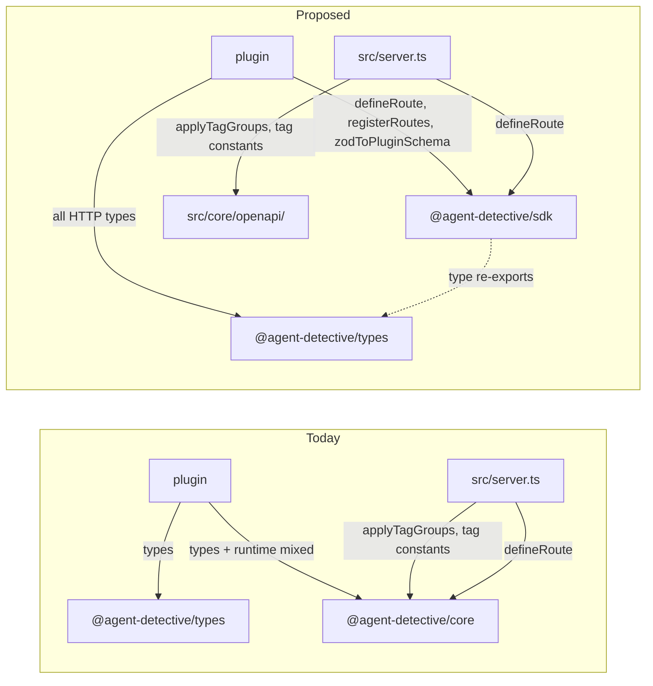

# 2026-04 Plugin SDK package split

## Goal

Reshape the post-Fastify HTTP package surface so plugin authors have a clear, self-documenting npm coordinate to depend on, while keeping [`@agent-detective/types`](https://github.com/toniop99/agent-detective/blob/main/packages/types/src/index.ts) **type-only**.

Concretely: move all HTTP-related **type declarations** into [`@agent-detective/types`](https://github.com/toniop99/agent-detective/blob/main/packages/types/src/index.ts), rename **`packages/core` → `packages/sdk`** (`@agent-detective/core` → `@agent-detective/sdk`) so the runtime helpers are obvious as the plugin SDK, and pull host-only utilities (`applyTagGroups`, tag constants) out of the shared package and into [`src/core/`](https://github.com/toniop99/agent-detective/blob/main/src/core) where only the host imports them.

After this lands, a plugin author writes:

```typescript
import type {
  Plugin, PluginContext, RouteDefinition, RouteSchema, HttpMethod, FastifyScope,
} from '@agent-detective/types';
import { defineRoute, registerRoutes, zodToPluginSchema } from '@agent-detective/sdk';
```

Two imports, each with an obvious role: the type contract vs the runtime SDK.

## Non-goals

- No behavior changes. Every endpoint keeps the same status codes, body shapes, and OpenAPI output. This is a package-boundary refactor only.
- No new framework, no new validation library, no new docs renderer.
- No npm publish dance. The packages are workspace-only today; if/when we publish, the rename is already in place. (Track external publish coordination separately if it becomes relevant.)
- No change to [`PluginContext`](https://github.com/toniop99/agent-detective/blob/main/packages/types/src/index.ts) — `defineRoute` / `registerRoutes` stay as free imports because they are used at module scope, before any context exists.
- No change to the Fastify wiring or Zod-first schema strategy from [`docs/exec-plans/completed/2026-04-http-layer-modernization.md`](/docs/exec-plans/completed/2026-04-http-layer-modernization/).

## Today

Before this migration, `packages/core/src/` contained 263 LoC across five files mixing three different audiences:

- **Plugin-facing types** (used as compile-time contracts):
  `route.ts` — `RouteDefinition`, `RouteSchema`, `HttpMethod`, `FastifyScope`.
  `spec.ts` — `TagGroup`, `ApplyTagGroupsOptions`.
- **Plugin-facing runtime helpers** (called by plugin authors):
  `route.ts` — `defineRoute()`, `registerRoutes()`.
  `zod-to-plugin-schema.ts` — `zodToPluginSchema()`.
- **Host-only runtime utilities** (only [`src/server.ts`](https://github.com/toniop99/agent-detective/blob/main/src/server.ts) imports these):
  `spec.ts` — `applyTagGroups()`.
  `constants.ts` — `CORE_PLUGIN_TAG`, `RESERVED_TAGS`, `SCALAR_TAG_GROUPS`, `createTagDescription()`.

Plugins in [`packages/local-repos-plugin`](https://github.com/toniop99/agent-detective/blob/main/packages/local-repos-plugin), [`packages/jira-adapter`](https://github.com/toniop99/agent-detective/blob/main/packages/jira-adapter), and [`packages/pr-pipeline`](https://github.com/toniop99/agent-detective/blob/main/packages/pr-pipeline) currently import from both `@agent-detective/types` (types) and `@agent-detective/core` (mix of types + runtime). The `core` name reads like host internals, not a plugin SDK; and host-only helpers leak through the shared package even though plugins never call them.

## Plan

One PR, five mechanical commits in this order.

### 1. Move HTTP types into `@agent-detective/types`

Add a new [`packages/types/src/http.ts`](https://github.com/toniop99/agent-detective/blob/main/packages/types/src/http.ts) (re-exported from [`packages/types/src/index.ts`](https://github.com/toniop99/agent-detective/blob/main/packages/types/src/index.ts)) containing the **type declarations only** currently in `packages/core/src/route.ts` and `packages/core/src/spec.ts`:

- `HttpMethod`, `RouteSchema`, `RouteDefinition`, `FastifyScope` (from `route.ts`).
- `TagGroup`, `ApplyTagGroupsOptions` (from `spec.ts`).

Type-only by construction:

- All declarations are `interface` or `type` aliases. Source uses `import type { ... }` from `fastify` and `import type { z } from 'zod'` so emit produces no runtime imports.
- Add `zod: catalog:` to [`packages/types/package.json`](https://github.com/toniop99/agent-detective/blob/main/packages/types/package.json) `dependencies` (it already has `fastify`). Both are used purely for `import type`; the package emits no runtime code.

Verify post-build: `tsup` output for `@agent-detective/types` has no executable statements (only type-stripped `export {}` shells).

### 2. Rename `packages/core` → `packages/sdk`

- Move the directory.
- Update [`packages/sdk/package.json`](https://github.com/toniop99/agent-detective/blob/main/packages/sdk/package.json) — `"name": "@agent-detective/sdk"`, description "Runtime SDK for agent-detective plugin authors (defineRoute, registerRoutes, zodToPluginSchema)", and trim `dependencies` to what stays in the package (see step 3): `@agent-detective/types`, `fastify`, `fastify-type-provider-zod`, `zod`. Drop `@fastify/swagger` and `openapi-types` — those move with `applyTagGroups` to the host.
- Update [`pnpm-workspace.yaml`](https://github.com/toniop99/agent-detective/blob/main/pnpm-workspace.yaml) — no change needed (`packages/*` glob still matches), but verify after rename.
- Update Turbo cache will rebuild automatically.

### 3. Trim the renamed SDK to runtime-only

In `packages/sdk/src/`:

- Keep `route.ts` but reduce it to runtime: re-export the types from `@agent-detective/types` for ergonomic re-imports, and keep `defineRoute()` (identity helper) plus `registerRoutes()` (Fastify scope wiring). Total ~30 LoC.
- Keep `zod-to-plugin-schema.ts` unchanged (~30 LoC).
- **Delete** `spec.ts` (moves to host — step 4).
- **Delete** `constants.ts` (moves to host — step 4).
- Rewrite `index.ts` to export only: `defineRoute`, `registerRoutes`, `zodToPluginSchema`, plus type re-exports `RouteDefinition`, `RouteSchema`, `HttpMethod`, `FastifyScope` from `@agent-detective/types`.

Final SDK size target: ~120 LoC across three files.

### 4. Move host-only utilities into `src/core/openapi/`

Create [`src/core/openapi/tag-groups.ts`](https://github.com/toniop99/agent-detective/blob/main/src/core) with `applyTagGroups()` and the `TagGroup` consumer code, and [`src/core/openapi/tags.ts`](https://github.com/toniop99/agent-detective/blob/main/src/core) with `CORE_PLUGIN_TAG`, `RESERVED_TAGS`, `SCALAR_TAG_GROUPS`, `createTagDescription()`. Both files import the `TagGroup` and `ApplyTagGroupsOptions` *types* from `@agent-detective/types`.

Update [`src/server.ts`](https://github.com/toniop99/agent-detective/blob/main/src/server.ts) imports:

```typescript
import { applyTagGroups } from './core/openapi/tag-groups.js';
import { CORE_PLUGIN_TAG, createTagDescription } from './core/openapi/tags.js';
```

The host stops depending on `@agent-detective/sdk` for these utilities — it still depends on the SDK for `defineRoute` (used by [`src/core/core-api-controller.ts`](https://github.com/toniop99/agent-detective/blob/main/src/core/core-api-controller.ts)).

### 5. Update import sites and configs

Mechanical sweep — every `from '@agent-detective/core'` becomes either `from '@agent-detective/types'` (for types) or `from '@agent-detective/sdk'` (for runtime).

Files to touch:

- [`src/server.ts`](https://github.com/toniop99/agent-detective/blob/main/src/server.ts) — see step 4.
- [`src/core/core-api-controller.ts`](https://github.com/toniop99/agent-detective/blob/main/src/core/core-api-controller.ts) — `defineRoute` from `sdk`, types from `types`.
- [`packages/local-repos-plugin/src/index.ts`](https://github.com/toniop99/agent-detective/blob/main/packages/local-repos-plugin/src/index.ts), [`packages/local-repos-plugin/src/presentation/repos-controller.ts`](https://github.com/toniop99/agent-detective/blob/main/packages/local-repos-plugin/src/presentation/repos-controller.ts) — same split.
- [`packages/jira-adapter/src/index.ts`](https://github.com/toniop99/agent-detective/blob/main/packages/jira-adapter/src/index.ts), [`packages/jira-adapter/src/presentation/jira-webhook-controller.ts`](https://github.com/toniop99/agent-detective/blob/main/packages/jira-adapter/src/presentation/jira-webhook-controller.ts) — same split.
- [`packages/pr-pipeline/src/index.ts`](https://github.com/toniop99/agent-detective/blob/main/packages/pr-pipeline/src/index.ts) — `zodToPluginSchema` from `sdk`.
- [`test/core/http/route.test.ts`](https://github.com/toniop99/agent-detective/blob/main/test/core/http/route.test.ts) — `applyTagGroups` import moves to the host module path; `defineRoute`/`registerRoutes` from `sdk`.
- Each plugin's `package.json`:
  - Replace `"@agent-detective/core": "workspace:*"` with `"@agent-detective/sdk": "workspace:*"`.
  - Add `"@agent-detective/types": "workspace:*"` if not already present (most already have it).
- Each plugin's `tsconfig.json` paths block — `@agent-detective/core` alias becomes `@agent-detective/sdk` and pointer updated to `../../sdk/src/index.ts`.
- Each plugin's `tsup.config.ts` externals — `@agent-detective/core` → `@agent-detective/sdk`.
- Root [`package.json`](https://github.com/toniop99/agent-detective/blob/main/package.json) and [`tsup.config.ts`](https://github.com/toniop99/agent-detective/blob/main/tsup.config.ts) — same rename.

After this commit, `rg '@agent-detective/core'` should return only historical references in `docs/exec-plans/completed/` and `docs/architecture/adr/0002-http-framework.md` (those are correct historical records and stay).

### 6. Documentation pass

- [`README.md`](https://github.com/toniop99/agent-detective/blob/main/README.md) — update the "Packages" table: rename `@agent-detective/core` row to `@agent-detective/sdk`, description "Runtime SDK for plugin authors (`defineRoute`, `registerRoutes`, `zodToPluginSchema`)". Note types live in `@agent-detective/types`.
- [`AGENTS.md`](https://github.com/toniop99/agent-detective/blob/main/AGENTS.md) — update the Packages section with the same rename.
- [`docs/plugins/plugin-development.md`](/docs/plugins/plugin-development/) — every `@agent-detective/core` import in the example snippets and `package.json` blocks becomes `@agent-detective/sdk`; route-type imports (when shown) move to `@agent-detective/types`. Update the `pnpm add` example.
- [`docs/architecture/architecture.md`](/docs/architecture/architecture/) and [`docs/architecture/adr/0001-layering-and-plugin-boundaries.md`](/docs/architecture/adr/0001-layering-and-plugin-boundaries/) — wherever `@agent-detective/core` is named.
- [`docs/development/development.md`](/docs/development/development/) — same.
- JSDoc in [`packages/types/src/index.ts`](https://github.com/toniop99/agent-detective/blob/main/packages/types/src/index.ts) at `Plugin.register` — update the "Register routes via `registerRoutes(scope, [...])` from `@agent-detective/core`" sentence to point at `@agent-detective/sdk`.
- Run [`pnpm run docs:site:sync`](https://github.com/toniop99/agent-detective/blob/main/scripts/sync-starlight-content.mjs) to regenerate the Starlight mirror under [`apps/docs/src/content/docs/`](https://github.com/toniop99/agent-detective/blob/main/apps/docs/src/content/docs).
- Add a changeset entry under `.changeset/` (markdown) — flag the package rename as a breaking change for any external plugin authors. Include the upgrade snippet.

### 7. Verify

```bash
pnpm install              # reflects workspace rename
pnpm run build
pnpm run build:app
pnpm typecheck
pnpm test
pnpm run lint             # incl. internal-link checker
node dist/index.js        # smoke: server boots, /api/health returns ok, POST /api/agent/run with {} returns 400, SIGTERM shuts down clean
```

## Architecture diff



## Acceptance criteria

- [ ] `packages/sdk/` exists with `name: "@agent-detective/sdk"`; `packages/core/` is gone.
- [ ] `packages/types/src/` contains `RouteDefinition`, `RouteSchema`, `HttpMethod`, `FastifyScope`, `TagGroup`, `ApplyTagGroupsOptions` and ships **zero runtime code** (`tsup` output is type-stripped only). Verified by inspecting `packages/types/dist/index.js`.
- [ ] `src/core/openapi/tag-groups.ts` and `src/core/openapi/tags.ts` exist and are the only callers of `applyTagGroups`, `CORE_PLUGIN_TAG`, etc. No package outside `src/` imports them.
- [ ] `rg '@agent-detective/core' -- ':!docs/exec-plans/completed' ':!docs/architecture/adr/0002-http-framework.md' ':!apps/docs/src/content/docs/exec-plans/completed' ':!pnpm-lock.yaml'` returns no matches.
- [ ] All three official plugins (`local-repos-plugin`, `jira-adapter`, `pr-pipeline`) and the root build green: `pnpm run build && pnpm run build:app && pnpm typecheck && pnpm test && pnpm run lint`.
- [ ] Smoke test: `node dist/index.js` boots, `/api/health` returns `{ status: 'ok' }`, `POST /api/agent/run` with `{}` returns HTTP 400 (Zod validation), SIGTERM shuts down.
- [ ] [`docs/plugins/plugin-development.md`](/docs/plugins/plugin-development/) examples reference `@agent-detective/sdk` and `@agent-detective/types`. Starlight mirror regenerated; `pnpm run lint` (which runs the docs internal-link checker) passes.
- [ ] Changeset under `.changeset/` documents the rename and shows the upgrade diff for plugin authors.

## Notes / decisions

- **Why not put functions on `PluginContext`.** `zodToPluginSchema` is called at *module scope* to populate the `Plugin.schema` literal before any `PluginContext` exists (see [`packages/local-repos-plugin/src/index.ts`](https://github.com/toniop99/agent-detective/blob/main/packages/local-repos-plugin/src/index.ts)). `defineRoute` benefits from module-scope usage so plugins can declare routes outside `register()` (the controller-style organisation already used by [`packages/jira-adapter/src/presentation/jira-webhook-controller.ts`](https://github.com/toniop99/agent-detective/blob/main/packages/jira-adapter/src/presentation/jira-webhook-controller.ts)). Forcing both through `context` would regress both patterns and add API surface to `PluginContext` for a function (`defineRoute`) whose only purpose is type inference.
- **Why not collapse everything into `@agent-detective/types`.** That would force `types` to ship runtime code, which the author explicitly ruled out.
- **Why a rename is worth it.** The package name is a developer-experience signal. `@agent-detective/core` reads like host internals; `@agent-detective/sdk` immediately tells a plugin author "this is the package I depend on to build a plugin." Cost is one mechanical sweep; benefit is permanent.
- **Risk.** Any external (out-of-tree) plugins break because of the package rename. Mitigated by the changeset entry and by the fact that no published 1.0 plugin contract exists yet — there is no live ecosystem to break.
- **Out of scope, tracked separately.** Whether `@agent-detective/types` should publish `fastify` and `zod` as `peerDependencies` instead of `dependencies` (cleaner for external consumers) is a separate cleanup. Not blocking.

## Related

- [`docs/exec-plans/completed/2026-04-http-layer-modernization.md`](/docs/exec-plans/completed/2026-04-http-layer-modernization/) — preceding migration that produced the current package shape.
- [`docs/architecture/adr/0001-layering-and-plugin-boundaries.md`](/docs/architecture/adr/0001-layering-and-plugin-boundaries/) — layering rules; this plan does not change them, only the package boundaries underneath.
- [`docs/architecture/adr/0002-http-framework.md`](/docs/architecture/adr/0002-http-framework/) — Fastify decision that landed `defineRoute` / `registerRoutes` in the first place.
- [`docs/development/agent-harness.md`](/docs/development/agent-harness/) — verification commands.
