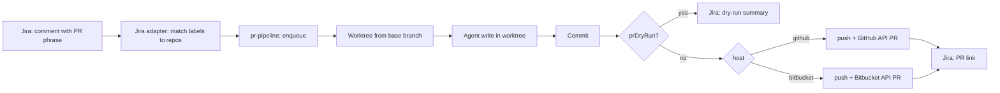

# Application configuration

Configuration is loaded at process startup from JSON files under the **`config/`** directory relative to the current working directory (`process.cwd()`), then merged with a small **environment whitelist** (no generic nested env keys such as `FOO__bar__baz`).

## Files

| File | Role |
|------|------|
| `config/default.json` | Base settings (checked into the repo). |
| `config/local.json` | Optional overrides (typically gitignored). |

`local.json` is **deep-merged** over `default.json`. Arrays are replaced, not concatenated.

## Core env whitelist

These variables override or extend the merged JSON when set:

| Variable | Effect |
|----------|--------|
| `PORT` | HTTP listen port (integer). |
| `AGENT` | Default agent id (e.g. `opencode`). |
| `AGENTS_OPENCODE_MODEL`, `AGENTS_CLAUDE_MODEL`, `AGENTS_GEMINI_MODEL` | Per-agent default model. |
| `AGENTS_<ID>_MODEL` | Any agent id in uppercase letters/digits (e.g. `AGENTS_OPENCODE_MODEL`). |
| `AGENTS_RUNNER_TIMEOUT_MS` | `agents.runner.timeoutMs` (agent child process + exec timeout, ms). |
| `AGENTS_RUNNER_MAX_BUFFER_BYTES` | `agents.runner.maxBufferBytes` |
| `AGENTS_RUNNER_POST_FINAL_GRACE_MS` | `agents.runner.postFinalGraceMs` (SIGTERM delay before kill). |
| `AGENTS_RUNNER_FORCE_KILL_DELAY_MS` | `agents.runner.forceKillDelayMs` (after SIGTERM, before SIGKILL). |
| `OBSERVABILITY_REQUEST_LOGGER_EXCLUDE_PATHS` | Comma-separated paths; merged into `observability.requestLogger.excludePaths` (default logs skip `/api/health` and `/api/metrics`). |
| `DOCS_AUTH_REQUIRED` | `true` / `false` — require `X-API-KEY` for `/docs`. |
| `DOCS_API_KEY` | API key value when docs auth is enabled. |

## Observability log level

`@agent-detective/observability` reads **`OBSERVABILITY_LOG_LEVEL`**. If you set **`LOG_LEVEL`** to `debug`, `info`, `warn`, or `error` and leave `OBSERVABILITY_LOG_LEVEL` unset, the app mirrors `LOG_LEVEL` into `OBSERVABILITY_LOG_LEVEL` before observability starts.

## Plugin env whitelist (first-party)

Env is merged **only into an existing** `plugins[]` entry with the matching `package` string (plugins are not auto-added from env alone).

| Variable | Target |
|----------|--------|
| `JIRA_API_TOKEN`, `JIRA_EMAIL`, `JIRA_BASE_URL` | Options for `@agent-detective/jira-adapter` (`apiToken`, `email`, `baseUrl`). |
| `JIRA_AUTO_ANALYSIS_COOLDOWN_MS` | `options.autoAnalysisCooldownMs` on the Jira plugin (default 600000). |
| `JIRA_MISSING_LABELS_REMINDER_COOLDOWN_MS` | `options.missingLabelsReminderCooldownMs` (default 60000). |
| `REPO_CONTEXT_GIT_LOG_MAX_COMMITS` | Positive integer → `options.repoContext.gitLogMaxCommits` (local-repos). |
| `REPO_CONTEXT_GIT_COMMAND_TIMEOUT_MS` | `options.repoContext.gitCommandTimeoutMs` |
| `REPO_CONTEXT_GIT_MAX_BUFFER_BYTES` | `options.repoContext.gitMaxBufferBytes` |
| `REPO_CONTEXT_DIFF_FROM_REF` | `options.repoContext.diffFromRef` (e.g. `HEAD~5`) |
| `SUMMARY_MAX_OUTPUT_CHARS` | `options.summaryGeneration.maxOutputChars` |
| `GITHUB_TOKEN`, `GH_TOKEN` | `options.githubToken` on `@agent-detective/pr-pipeline` (if that plugin is listed). `GITHUB_TOKEN` wins over `GH_TOKEN`, then file. At **runtime** the same order applies. |
| `BITBUCKET_TOKEN` | `options.bitbucketToken` on pr-pipeline (access token; env overrides file). |
| `BITBUCKET_USERNAME`, `BITBUCKET_APP_PASSWORD` | `options.bitbucketUsername` / `options.bitbucketAppPassword` (app password; env overrides file). Ignored if a Bitbucket access token is set. |

For a step-by-step local webhook test (tunnel, labels, smoke script), see [jira-manual-e2e.md](jira-manual-e2e.md). For **Jira → pull request** (pr-pipeline), see [jira-pr-pipeline-manual-e2e.md](jira-pr-pipeline-manual-e2e.md).

## PR pipeline (`@agent-detective/pr-pipeline`)

Jira comment (default phrase `#agent-detective pr`, configurable as `prTriggerPhrase` on the Jira plugin) can trigger an **isolated git worktree**, a **write-mode** agent run, **commit + push**, and a **pull request** on **GitHub** or **Bitbucket Cloud** — when `vcs` is set on the matching local-repos repo and credentials are available.

**Extra context in the same comment:** any text in the Jira comment **after removing the first occurrence of the PR trigger phrase** (case-insensitive) is passed to the agent as *Additional context from the Jira comment* (e.g. file paths, commit hashes, or a short error description), in addition to the issue description. Example: `#agent-detective pr this error is related to the changes in authentication.php in commit 751b957`.

**Precedence (always):** values from **environment variables** override the same keys in **merged JSON** (`default.json` + `local.json`) for both the [plugin env merge](#plugin-env-whitelist-first-party) at load time and, for tokens, the [runtime resolution](#host-credentials-precedence) used when the job runs. Prefer secrets in **env** in production; use `config/local.json` (gitignored) for local dev if you accept file-based secrets.

### Host credentials precedence

| Secret | First wins | Then | Then |
|--------|------------|------|------|
| GitHub token | `GITHUB_TOKEN` | `GH_TOKEN` | `plugins[].options.githubToken` for `@agent-detective/pr-pipeline` |
| Bitbucket access token (preferred for CI) | `BITBUCKET_TOKEN` | | `options.bitbucketToken` in JSON for pr-pipeline |
| Bitbucket app password (alternative) | `BITBUCKET_USERNAME` + `BITBUCKET_APP_PASSWORD` | | `bitbucketUsername` + `bitbucketAppPassword` in JSON |

**If a Bitbucket access token is set, app-password options are not used** (smaller, token-shaped secret; matches [Atlassian: using access tokens](https://support.atlassian.com/bitbucket-cloud/docs/using-access-tokens/)).

Empty or whitespace-only values are ignored; the next source in the chain is used.

**Bitbucket — access token API / Git (when `BITBUCKET_TOKEN` or `bitbucketToken` is set):** REST calls use a `Bearer` token. Git uses `x-token-auth` as the username and the token in the URL (see [using access tokens](https://support.atlassian.com/bitbucket-cloud/docs/using-access-tokens/)). Use a **repository** or **workspace access token** with *pull request* (write) scope for opening PRs.

**Bitbucket — app password (when no access token is set):** [app password](https://support.atlassian.com/bitbucket-cloud/docs/app-passwords/) plus your Bitbucket **account username**; REST uses HTTP Basic, Git uses username + password in the URL.

**Per-repo `vcs`** (under `local-repos` `repos[]`) selects the host; **branch prefix and base** can be set per repo (`prBranchPrefix`, `prBaseBranch`).

- GitHub: `"vcs": { "provider": "github", "owner": "my-org", "name": "my-repo" }`
- Bitbucket: `"vcs": { "provider": "bitbucket", "owner": "<workspace>", "name": "<repo-slug>" }`

### End-to-end flow



1. A matching **label** maps the issue to a **local-repos** entry (`path` + optional `vcs` / `prBaseBranch` / `prBranchPrefix`).  
2. The pipeline creates a **temporary worktree**, runs the **agent** with the Jira text, **commits** if there are changes.  
3. If **`prDryRun`** is true (default in `config/default.json`), it posts a Jira note only (no push).  
4. If not dry-run, it **pushes** to `origin` on the chosen host and **opens a PR** using the **resolved tokens** above.  
5. A **Jira comment** includes the PR URL or an error.

Option reference: [docs/generated/plugin-options.md](generated/plugin-options.md) (block **@agent-detective/pr-pipeline**, anchor `pr-pipeline`).

## Validation

After merge and env application, the top-level config is validated with **Zod** (`src/config/schema.ts`). Invalid shapes cause startup to fail with an error message.

## Plugin option schemas (generated)

Zod option schemas for bundled plugins drive both runtime validation in `register()` and generated reference docs:

- [docs/generated/plugin-options.md](generated/plugin-options.md)

Regenerate after editing `packages/*/src/options-schema.ts`:

```bash
pnpm docs:plugins
```

CI enforces that the generated file is up to date (`pnpm docs:plugins:check`).

## See also

- [Docker environment variables](docker.md#production-style-run-single-host)
- [Development guide](development.md#configuration)
- [Plugin development](plugins.md#3-schema-system)
