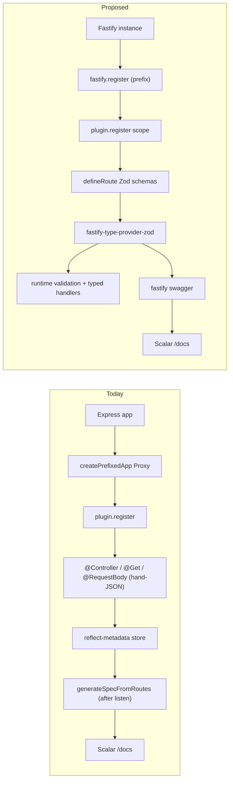

# 2026-04 HTTP layer modernization

## Goal

Replace the homegrown HTTP layer — **Express 5** + `reflect-metadata` decorators + hand-written JSON Schema literals + post-`listen` OpenAPI assembly — with a **Zod-first, schema-validated framework** so plugins get real request validation, typed handlers, and OpenAPI for free, without us maintaining `packages/core/src/{decorators,controller,spec-generator,metadata}.ts` (~600 LoC of in-house framework).

The work is split in two phases. **Phase 1** produces a comparison ADR and gates on the user's framework decision. **Phase 2** is a single big-bang PR that swaps the framework everywhere (commit-by-commit inside the PR for review-ability).

## Non-goals

- HTTP/2, WebSockets, OpenTelemetry exporters, or new auth schemes beyond the existing `X-API-KEY` `/docs` gate. Track in [`tech-debt.md`](../tech-debt.md) if they come up.
- Persistent / cross-process queues. Already covered by [`TaskQueue`](../../../packages/types/src/index.ts) extension points.

## Pain points (today)

Anchored to real files so future agents can verify:

- **No runtime validation.** Handlers manually check `if (!agentId || !prompt)` ([`src/core/core-api-controller.ts`](../../../src/core/core-api-controller.ts)). `@RequestBody({ schema })` is documentation-only.
- **Hand-written JSON Schema.** ~100 lines of literal JSON Schema in [`packages/jira-adapter/src/presentation/jira-webhook-controller.ts`](../../../packages/jira-adapter/src/presentation/jira-webhook-controller.ts) drifts from runtime.
- **Two schema worlds.** Plugin **config** uses Zod 4 via [`zodToPluginSchema`](../../../packages/sdk/src/zod-to-plugin-schema.ts); HTTP **requests/responses** use hand-written JSON. Zod 4 is already in the catalog.
- **In-house framework surface.** `packages/core/src/decorators.ts`, `controller.ts`, `spec-generator.ts`, `metadata.ts` reinvented controller scanning + OpenAPI generation. *(All deleted in this migration.)*
- **Plugin scoping is a Proxy hack.** [`createPrefixedApp`](../../../src/core/plugin-system.ts) wraps the Express app in a `Proxy` to rewrite paths — fragile around middleware ordering and error boundaries.
- **Late spec assembly.** [`src/index.ts`](../../../src/index.ts) builds the OpenAPI spec **after `app.listen`** by reading reflect-metadata back out — works, but couples startup ordering to the docs pipeline.

## Phase 1 — Comparison ADR (always)

Author one ADR at [`docs/architecture/adr/0002-http-framework.md`](../../architecture/adr/0002-http-framework.md) (sibling of [`0001-layering-and-plugin-boundaries.md`](../../architecture/adr/0001-layering-and-plugin-boundaries.md)). Reference it from [`AGENTS.md`](../../../AGENTS.md) "Where to read" and from [`docs/README.md`](../../README.md). Drop a one-liner in [`tech-debt.md`](../tech-debt.md) until Phase 2 lands.

The ADR must contain:

1. **Pain points** — copy of the section above.
2. **Candidates with concrete code samples** rewriting `CoreApiController.runAgent` and `JiraWebhookController.handleWebhook` in each:
   - **A. Express + Zod** — keep Express; replace decorators with a thin `defineRoute({ method, path, request, responses, handler })` registrar; use [`@asteasolutions/zod-to-openapi`](https://github.com/asteasolutions/zod-to-openapi) for the spec; Zod middleware validates `req.body`. Lowest risk, smallest diff, but we still own the registrar.
   - **B. Fastify + `fastify-type-provider-zod` + `@scalar/fastify-api-reference`** — native plugin system replaces the Proxy (`fastify.register(plugin, { prefix: '/plugins/x' })`); schema-driven validation/serialization; OpenAPI from Zod; hooks; async error handling.
   - **C. NestJS + `@nestjs/swagger` + `nestjs-zod`** — closest to today's decorator style; DI/modules duplicate our plugin/service registry. Heaviest migration.
   - **D. Hono + `@hono/zod-openapi`** — small/fast/type-safe; weaker Node middleware ecosystem; loses Express middleware compat for any third-party plugin.
3. **Scorecard** (table is fine in the ADR) across: plugin model fit, Zod 4 / schema reuse, OpenAPI quality, validation/serialization, error handling, perf, ESM/Node 24 fit, ecosystem maturity, migration cost, third-party-plugin compatibility, long-term direction.
4. **Recommendation** — Fastify (B) as strongest long-term fit (real plugin encapsulation maps 1:1 onto our `@agent-detective/*` plugins; Zod-driven schemas eliminate duplicated JSON; OpenAPI is a side effect; Scalar adapter preserves `/docs` UX). Express+Zod (A) as the safest fallback if a framework swap is unwanted.
5. **Open questions** — third-party plugins relying on Express middleware? `/docs` UX must be byte-identical? Imminent need for upload/multipart, body-size limits, or rate limiting?
6. **Decision placeholder** — filled in by the user; flips ADR Status from `Proposed` to `Accepted` and unblocks Phase 2.

## Phase 2 — Big-bang migration (gated on Phase 1 decision)

Single PR, framework-agnostic shape. The Fastify variant is detailed below since that is the recommended path; per-framework variations are listed at the end.

### 2.1 New HTTP package surface

Rewrite the HTTP package surface (`packages/core/src/index.ts`, since renamed to [`packages/sdk/src/index.ts`](../../../packages/sdk/src/index.ts)) to expose a Zod-first route definition API. Delete `decorators.ts`, `controller.ts`, `metadata.ts`, `spec-generator.ts`, the decorator constants in `constants.ts`, and the `reflect-metadata` dependency from the root [`package.json`](../../../package.json). *(All deleted as part of this migration.)* Sketch:

```typescript
// packages/core/src/route.ts
import type { z } from 'zod';
export interface RouteDefinition<TBody, TQuery, TParams, TResp> {
  method: 'get' | 'post' | 'put' | 'delete' | 'patch';
  path: string;
  tags?: string[];
  summary?: string;
  description?: string;
  request?: { body?: z.ZodType<TBody>; query?: z.ZodType<TQuery>; params?: z.ZodType<TParams> };
  responses: Record<number, { description: string; body?: z.ZodType<TResp> }>;
  handler(input: { body: TBody; query: TQuery; params: TParams; req: FastifyRequest; reply: FastifyReply }): Promise<TResp> | TResp;
}
export function defineRoute<...>(def: RouteDefinition<...>): RouteDefinition<...> { return def; }
```

A `registerRoutes(scope, routes[])` adapter wires each route to `scope.route({ schema: { body, querystring, params, response }, handler })` using `fastify-type-provider-zod` so OpenAPI falls out automatically.

### 2.2 Rewrite root server

Replace [`src/server.ts`](../../../src/server.ts):

- Boot Fastify with `validatorCompiler` / `serializerCompiler` from `fastify-type-provider-zod`.
- Register `@fastify/swagger` with the same title / version / `Core` + `Plugins` tag groups previously produced by the now-deleted `generateSpecFromRoutes` (in the old `packages/core/src/spec-generator.ts`).
- Register `@scalar/fastify-api-reference` at `/docs` preserving the existing `docsAuthRequired` / `DOCS_API_KEY` gate from [`setupDocs`](../../../src/server.ts).
- Port [`createRequestLogger`](../../../packages/observability/src/middleware.ts) to a Fastify `onRequest` + `onResponse` hook (preserves correlation-id, metrics, exclude-paths).
- Drop the post-`listen` spec-assembly block in [`src/index.ts`](../../../src/index.ts) — the spec is built eagerly.

### 2.3 Rewrite the plugin system

[`src/core/plugin-system.ts`](../../../src/core/plugin-system.ts) currently hands plugins a `Proxy`-prefixed Express app. Replace with Fastify's native encapsulation:

```typescript
await fastify.register(async (scope) => {
  await plugin.register(scope, pluginContext);
}, { prefix: `/plugins/${sanitizePluginName(plugin.name)}` });
```

`createPrefixedApp` is deleted. Each plugin gets a real isolated context with its own hooks/error handlers. The "return controllers from `register()`" code path goes away — plugins define routes on the scope directly.

Update `Plugin.register` in [`packages/types/src/index.ts`](../../../packages/types/src/index.ts) from `(app: Application, ctx) => object[] | void` to `(scope: FastifyInstance, ctx) => void | Promise<void>`. **Breaking change** for third-party plugins — flag it in the ADR and ship a changeset.

### 2.4 Migrate every controller

Mechanical, one commit per file:

- [`src/core/core-api-controller.ts`](../../../src/core/core-api-controller.ts) — every endpoint becomes a `defineRoute` with Zod body / responses (replaces manual `if (!agentId || !prompt)` checks). The SSE branch keeps using `reply.raw` after `reply.hijack()`.
- [`packages/jira-adapter/src/presentation/jira-webhook-controller.ts`](../../../packages/jira-adapter/src/presentation/jira-webhook-controller.ts) — derive the Jira webhook body schema as Zod (replaces the ~100-line hand-written JSON Schema). Keep `resolveWebhookEvent` / `normalizeWebhookEventName` exports verbatim — domain logic.
- [`packages/local-repos-plugin/src/presentation/repos-controller.ts`](../../../packages/local-repos-plugin/src/presentation/repos-controller.ts) — list/get repos with Zod response schemas reused from the `ValidatedRepo` types in [`@agent-detective/types`](../../../packages/types/src/index.ts).

### 2.5 Tests

- Replace `test/core/openapi/decorators.test.ts`, `controller.test.ts`, `spec-generator.test.ts` with `defineRoute` / `registerRoutes` / spec-assertion tests using `fastify.inject()` (no real `listen`). *(Done — see [`test/core/http/route.test.ts`](../../../test/core/http/route.test.ts).)*
- Add new request-validation tests asserting `400` for missing/typewrong bodies (the headline win).
- Update [`packages/jira-adapter/test/jira-webhook-controller.test.ts`](../../../packages/jira-adapter/test/jira-webhook-controller.test.ts) to drive Fastify via `inject()`.

### 2.6 Docs and rules

- Flip ADR `0002` Status to **Accepted**.
- Update [`AGENTS.md`](../../../AGENTS.md) "HTTP" row, "Architecture (sketch)" line, and "Key files" table (Express → Fastify; remove `spec-generator.ts`).
- Update plugin examples in [`docs/plugins/plugins.md`](../../plugins/plugins.md) (the `register(app, context)` snippets) and any code samples that import from `@agent-detective/core` decorators.
- Update [`docs/development/agent-golden-rules.md`](../../development/agent-golden-rules.md) so agents stop reaching for `import type { Request, Response } from 'express'`.
- Run `pnpm docs:plugins` and `pnpm docs:config` to refresh generated docs; commit any diffs.
- Add a changeset marking the breaking plugin contract.

## Architecture diff



## Acceptance criteria

- [ ] ADR [`0002-http-framework.md`](../../architecture/adr/0002-http-framework.md) is merged with Status `Accepted`, references the chosen option, and is linked from [`AGENTS.md`](../../../AGENTS.md) and [`docs/README.md`](../../README.md).
- [ ] `reflect-metadata`, the custom decorators package surface, and `spec-generator.ts` are deleted from `packages/core/src` (since renamed to [`packages/sdk/src`](../../../packages/sdk/src)).
- [ ] Every endpoint that exists today still responds with the same status / body shape; `pnpm test` (root + Turbo) passes.
- [ ] `/docs` renders the Scalar UI with the `Core` and `Plugins` tag groups preserved.
- [ ] At least one route-validation test asserts a `400` for an invalid request body.
- [ ] `pnpm run lint` (incl. import guards in [`scripts/check-package-root-imports.mjs`](../../../scripts/check-package-root-imports.mjs) and [`scripts/check-plugin-cross-imports.mjs`](../../../scripts/check-plugin-cross-imports.mjs)) passes.
- [ ] `pnpm run build:app` produces a working `dist/index.js` per [`docs/operator/docker.md`](../../operator/docker.md).
- [ ] Changeset entry marks the breaking plugin-contract change.

## Notes / decisions

- **Phased execution.** Phase 1 always lands first. Phase 2 is a single big-bang PR but commit-by-commit inside (per file) for review-ability.
- **Recommended framework.** Fastify (option B). Express+Zod (A) is the documented fallback if a framework swap is rejected. NestJS (C) is **not recommended** — its DI/module system overlaps with our plugin/service registry.
- **Breaking change for third-party plugins.** `Plugin.register` signature changes. Document the migration in the ADR and in [`docs/plugins/plugins.md`](../../plugins/plugins.md).
- **Risks and mitigations.**
  - Third-party plugins break — changeset + migration note.
  - Fastify SSE differs from Express — covered by `reply.hijack()` in Phase 2.4.
  - `inject()`-based tests need refactor — scoped to Phase 2.5.
- **Out of scope.** Tracked separately in [`tech-debt.md`](../tech-debt.md).

## Related

- [`docs/architecture/adr/0001-layering-and-plugin-boundaries.md`](../../architecture/adr/0001-layering-and-plugin-boundaries.md) — keeps applying; this plan does not change layering, only the framework underneath the presentation layer.
- [`docs/plugins/plugins.md`](../../plugins/plugins.md) — must be updated alongside Phase 2.
- [`docs/development/agent-harness.md`](../../development/agent-harness.md) — verification commands.
