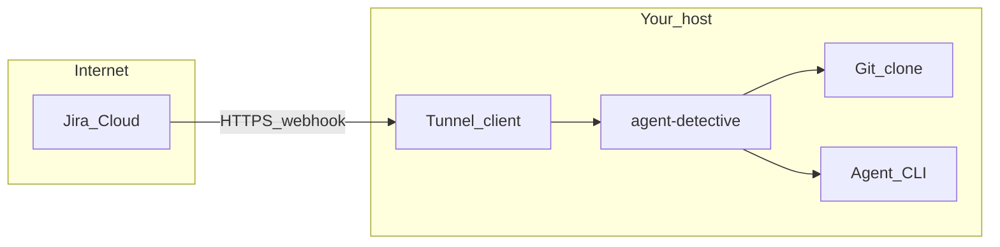

# Golden path — first analysis in about 15 minutes

This page is the **shortest** path to prove Agent Detective end-to-end. The default flow is **Jira → webhook → local repo → comment** (same story as the root [README.md](../../README.md)). Deep detail lives in [jira-manual-e2e.md](../e2e/jira-manual-e2e.md); use that when this checklist is not enough.

## Target outcome (15-minute bar)

- Server answers **`GET /api/health`** on your chosen port.
- **`agent-detective doctor`** (or **`validate-config`**) passes for your layout.
- A **Jira** (or Automation) webhook reaches your server through a **tunnel**.
- With **`mockMode: true`** on the Jira adapter, you see **`[MOCK] Added comment`** (or equivalent) in logs after an issue **with a matching repo label** is created.

If you need **real** Jira comments, add Jira API credentials and set **`mockMode: false`** — allow extra time for OAuth or token setup.

## Prerequisites (checklist)

| # | Requirement | Notes |
|---|-------------|--------|
| 1 | **Node.js 24+** and **pnpm 10+** | From source: see [development.md](../development/development.md). **Native binary:** no system Node — [binary.md](binary.md). |
| 2 | **Git** on `PATH` | Required for repo context and agents. |
| 3 | **Agent CLI** (e.g. OpenCode) on `PATH` | Match `config.agent` / `agent` key. [OpenCode install](https://opencode.ai/docs). |
| 4 | **LLM credentials** for that agent | Env vars or agent config as per vendor. |
| 5 | A **git clone** on disk | Will be registered under **local-repos** `repos[].name`. |
| 6 | **Jira Cloud** (or compatible) | Permission to create **webhooks** or **Automation → Send web request**. |
| 7 | **Tunnel** (ngrok, Cloudflare Tunnel, …) | Jira must reach **HTTPS** → your local port. |

## Steps (happy path)

1. **Clone and install** (from source):

   ```bash
   git clone <repo-url> && cd code-detective
   pnpm install
   ```

   Or install the **native binary** per [installation.mdx](installation.mdx).

2. **Config**

   - Copy [config/local.example.json](../../config/local.example.json) to **`config/local.json`** (gitignored).
   - Enable **`@agent-detective/local-repos-plugin`** with at least one **`repos`** entry: absolute **`path`**, stable **`name`** (e.g. `my-app`).
   - Enable **`@agent-detective/jira-adapter`** with **`mockMode: true`** for the first run.
   - See [configuration-hub.md](../config/configuration-hub.md) for load order.

3. **Validate**

   ```bash
   pnpm exec agent-detective doctor --config-root .
   ```

   Fix anything **error**-level before continuing.

4. **Run the server**

   ```bash
   pnpm dev
   ```

   Or `pnpm build && pnpm run build:app && pnpm start` for production-style.

5. **Tunnel**

   - Expose **`http://127.0.0.1:<port>`** (default **3001**) to a public **HTTPS** URL.

6. **Jira webhook**

   - URL path (fixed): **`https://<tunnel-host>/plugins/agent-detective-jira-adapter/webhook/jira`**
   - Subscribe at least to **Issue created** and **Comment created** (retry path).
   - If you use **Automation** without `webhookEvent` in the body, append the right **`?webhookEvent=jira:issue_created`** query — see [jira-manual-e2e.md](../e2e/jira-manual-e2e.md#which-webhook-source-are-you-using).

7. **Create a Jira issue**

   - Add a **label** equal to your repo **`name`** (case-insensitive match).
   - Put enough description/stack trace for the agent to analyze (or a minimal placeholder for a smoke test).

8. **Verify**

   - Logs: webhook accepted → task queued → agent invocation → **`[MOCK]`** comment line if mock mode.
   - **`GET /api/health`** stays **ok** (or **degraded** only if you expect missing optional checks).

## Reference layout (single VM)



Optional **nginx** TLS termination in front of the app is described in [deployment.md](deployment.md).

## Troubleshooting (quick)

| Symptom | What to check |
|---------|----------------|
| Webhook never hits server | Tunnel URL, Jira automation rule history, firewall, correct **POST** path under `/plugins/...`. |
| 400/404 on webhook | Path must match installed Jira plugin route; plugin loaded (`doctor`, startup logs). |
| No analysis, silent skip | Issue **labels** must match **`repos[].name`**; see [jira-manual-e2e.md](../e2e/jira-manual-e2e.md#matching-a-ticket-to-a-repository). |
| Agent fails immediately | `PATH`, API keys for LLM, `config.agent` id matches a registered agent. |
| Real Jira comment fails | `mockMode: false` + Basic or OAuth fields; [env whitelist](../../src/config/env-whitelist.ts) for secrets. |

## Next steps

- **Linear:** [linear-manual-e2e.md](../e2e/linear-manual-e2e.md)
- **PR pipeline:** [jira-pr-pipeline-manual-e2e.md](../e2e/jira-pr-pipeline-manual-e2e.md)
- **Production hardening:** [threat-model.md](threat-model.md), [deployment.md](deployment.md)

## Support matrix

See the table in the root [README.md](../../README.md#support-matrix) (kept next to quick start so it stays visible).
